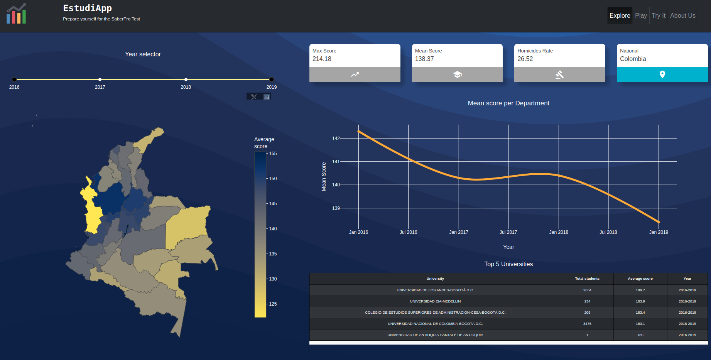
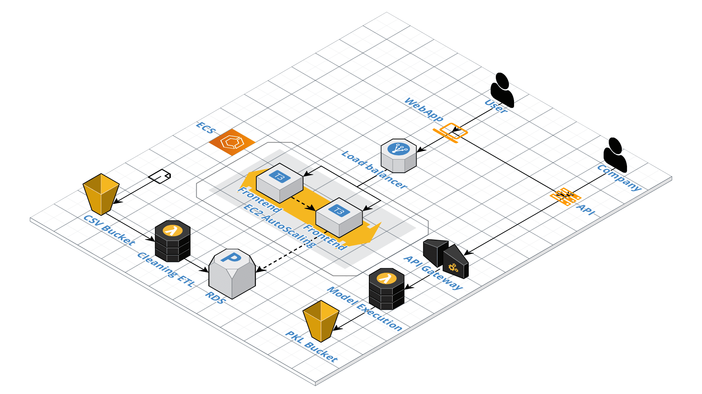
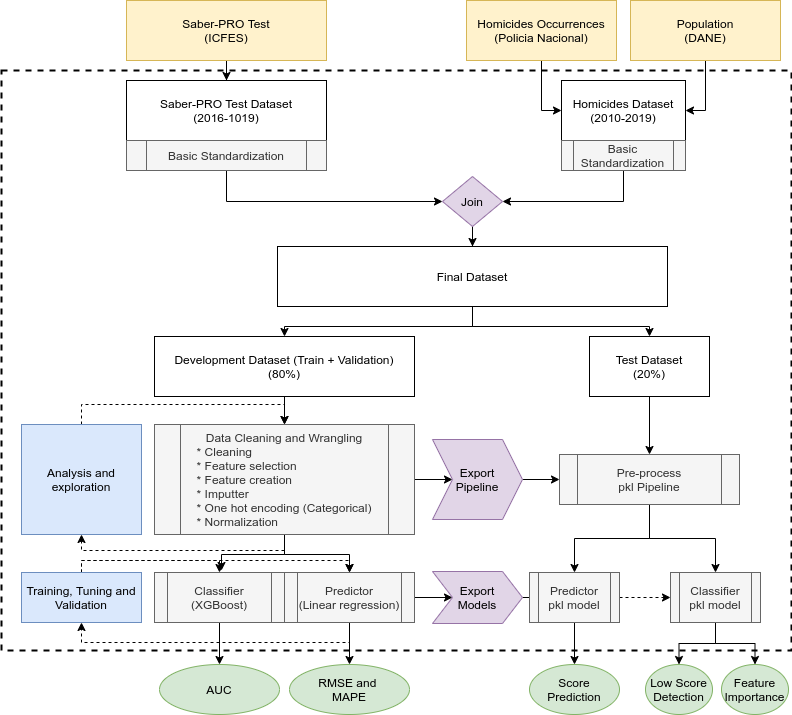
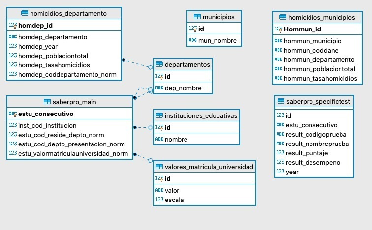
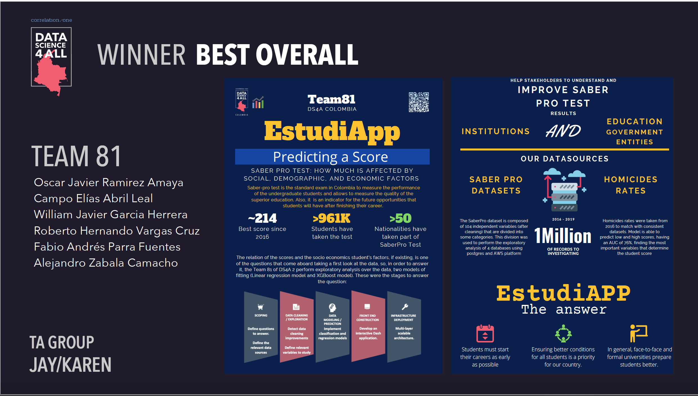

# EstudiApp Backend

[EstudiApp](https://www.google.com "EstudiApp Frontend") is powered by _AWS services_, of which we use the following:

- ECS for docker frontend:
  - EC2 cluster
  - Load Balancer for the frontend requests
  - ECR Repository
  - CI Pipeline for the build and deployment jobs
  - Task Definition with environment variables

- Backend (real-time predictions and features analysis)
  - Lambda functions to execute stored models
  - S3 buckets to store CSV files, PKL models and NPY arrays
  - API Gateway to expose lambda functions as API REST endpoints.

- RDS Postgres as SQL Database

The full stack can be diagramed as this:

## Lambda functions

The real time prediction engine is powered by _AWS Lambda_, which can be fount in the [aws_lambda](../-/tree/master/aws_lambda) folder.

### Environment variables

| Environment Variable | Description |
| ------ | ------ |
| BUCKET_NAME | Name of the S3 bucket |
| PKL_LINEAR | Route to the pkl file of the Linear model |
| PKL_PRE | Route to the pkl file of the preprocessing model |
| PKL_XGBOOST | Route to the pkl file of the XGBoost model |
| SHAPLEY_VALUES | Route to the npy file of the shap values |
| TEST_DATASET_V3 | V3 of the Saber-Pro Dataset |
| TEST_DATASET_V4 | V4 of the Saber-Pro Dataset |

## API REST

The exposure of the predictive functions was made with _AWS ApiGateway_

## Data science workflow

### Notebooks index

1. Data_Clean.ipynb: Data cleaning and wrangling
2. Exploratory_Analysis.ipynb: Exploratory analysis
3. Preprocess_Pipeline.ipynb: Dataset splitting and pre-processing pipeline
4. Linear_Model.ipynb: Linear regression model to predict the global score
5. Classification_Model.ipynb: XGBoost classifier for detecting low-score students

## Database

DDL script for the database scheme creation can be found in the [database](../-/tree/master/database/DS4ATeam81_DatabaseScript.sql) folder. For this project we use _AWS RDS_ with a postgres engine version 11.8. Capacity of the DB instance correspond to a **db.t2.micro** instance (1vCPU, 1 Gb of RAM). In order to optimize the queries process time, we add some materialized views that can be found with the DDL script.

### Er diagram

## DS4A - TEAM 81

Alejandro Zabala, Elias Abril, Fabio Parra, Oscar Ramirez, Roberto Vargas, William Garcia

Project presented in Data Science 4All program (2020), winner in Best Overall Category.

